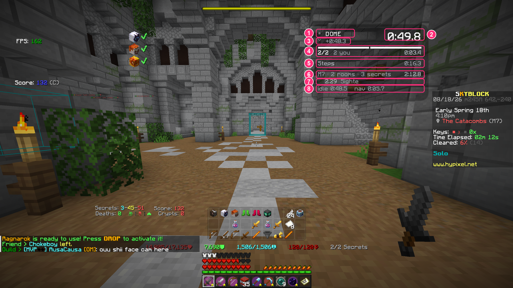
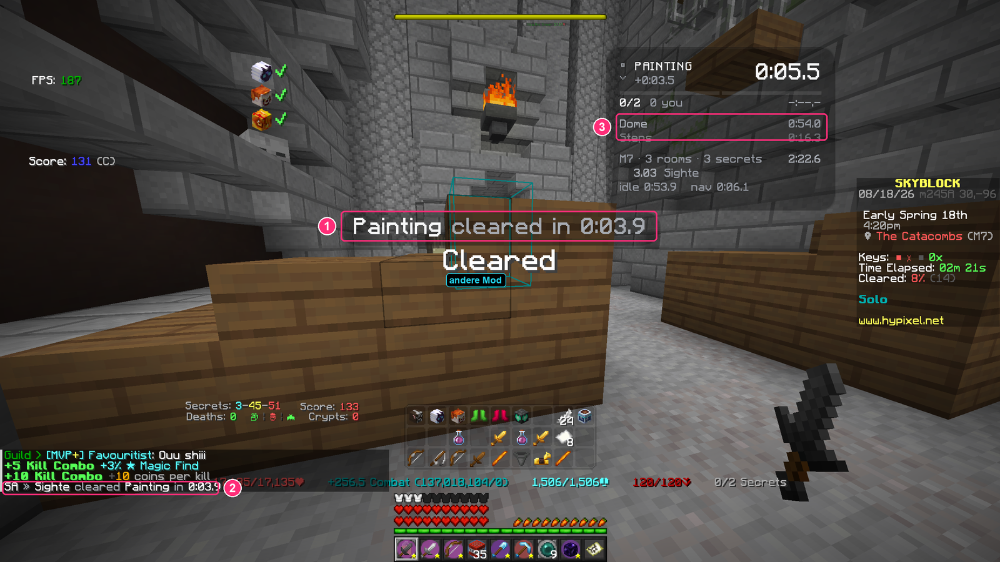
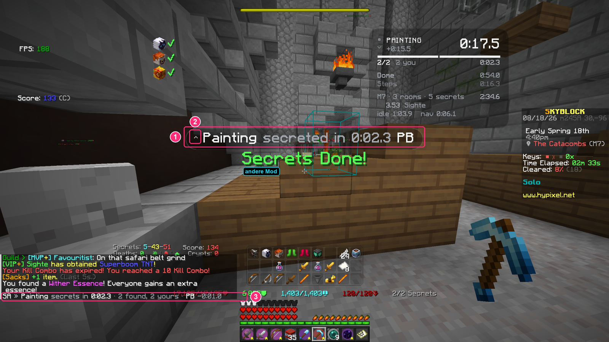
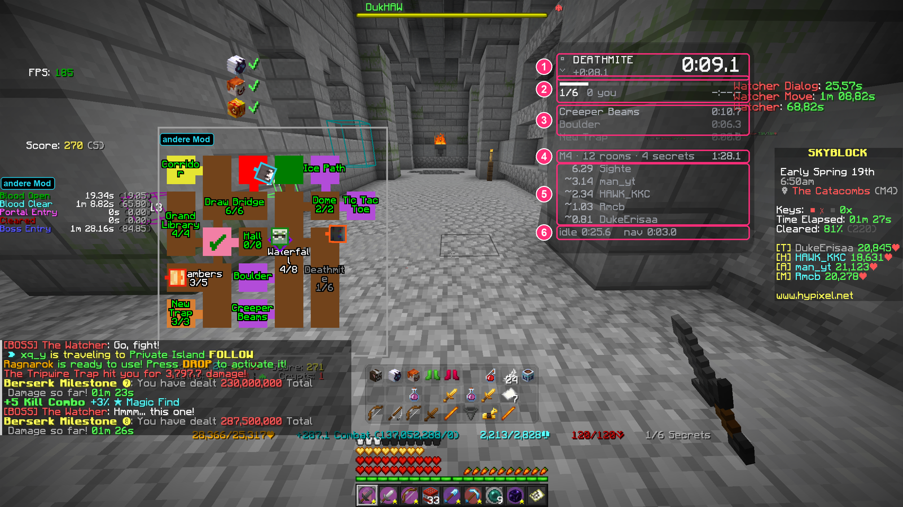
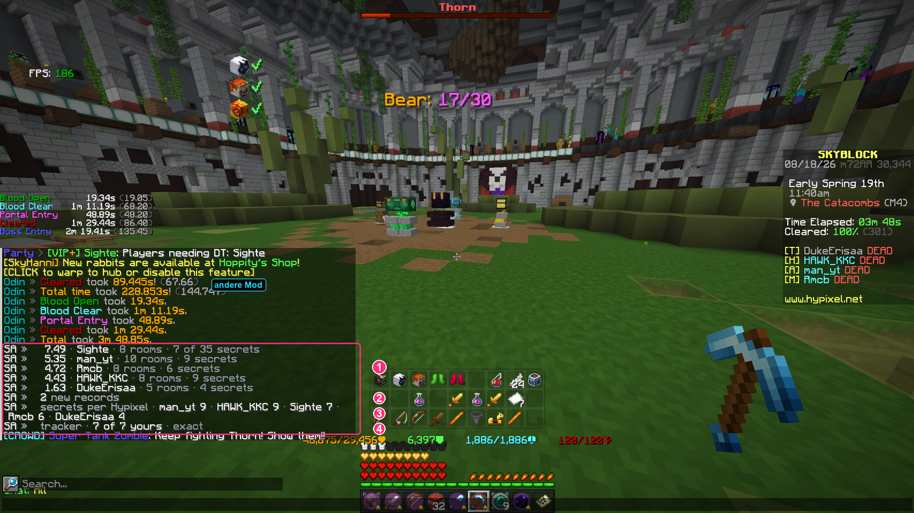
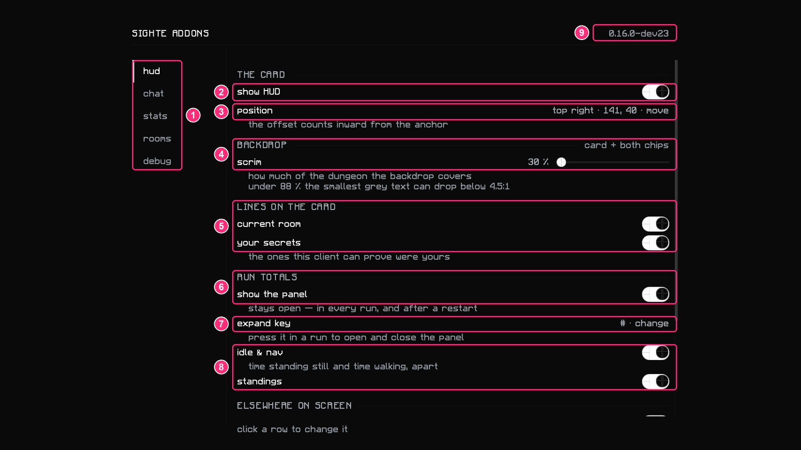
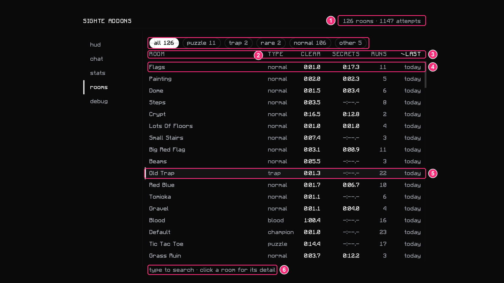
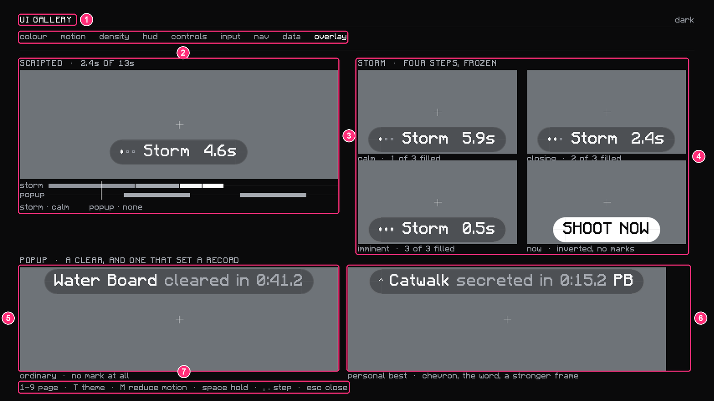

# Sighte Addons — Funktionen im Bild

Alles hier stammt aus echten Runs vom 18.08.2026, Build **0.16.0-dev23**: ein Solo-M7 und ein M4 in
der Party. Die Screenshots sind unbearbeitet bis auf die Markierungen.

> **Rosa umrandet = Sighte Addons.**
> **Cyan getaggt = gehört einer anderen Mod** (Odin, Skyblocker, SkyHanni, Hypixel selbst) und steht
> nur mit im Bild, weil es im selben Screenshot liegt. Die Mod zeichnet keine Map, keine Splits links
> und keine Titel in der Bildmitte.

Erzeugt wurden die Markierungen von [`annotate.py`](annotate.py) — Koordinaten drin, neu rendern
kostet einen Aufruf.

| | Thema |
|---|---|
| 1 | [Die Karte im Run](#1-die-karte-im-run) |
| 2 | [Raum fertig: Popup und Chatzeile](#2-raum-fertig-popup-und-chatzeile) |
| 3 | [Persönlicher Rekord](#3-persönlicher-rekord) |
| 4 | [Party: Standings und Schätzungen](#4-party-standings-und-schätzungen) |
| 5 | [Run-Ende: die Zusammenfassung](#5-run-ende-die-zusammenfassung) |
| 6 | [`/sa` — Einstellungen](#6-sa--einstellungen) |
| 7 | [`/sa pbs` — die Raum-Historie](#7-sa-pbs--die-raum-historie) |
| 8 | [`/sa gallery` — Storm-Timer und Popup-Zustände](#8-sa-gallery--storm-timer-und-popup-zustände) |

---

## 1. Die Karte im Run

Die Karte ist der einzige stehende Readout der Mod. Standardmäßig oben rechts, verschiebbar, und sie
blendet sich aus, sobald der Bossraum beginnt — ab da kann sich keine ihrer Zahlen mehr ändern.

| # | Was | Bedeutung |
|---|---|---|
| 1 | `▫ DOME` | Der Raum, in dem du stehst. Das Zeichen davor ist der Raumtyp: hohler Punkt = normal, Raute = Puzzle (gefüllt = Champion), Dreieck = Trap (gefüllt = Blood), Quadrat = Rare bzw. Entrance. Zwischen zwei Räumen steht hier `BETWEEN ROOMS` — ein Zustand, kein Loch. |
| 2 | `0:49.8` | Wie lange **du** in diesem Raum bist. Nicht die Run-Zeit, nicht der Moment des Häkchens — die Zeit, die du beeinflussen kannst, über Wiedereintritte hinweg addiert. |
| 3 | `˅ +0:48.3` | Der Split gegen deinen Rekord für genau diesen Raum. Chevron nach oben und `−` heißt schneller, nach unten und `+` heißt langsamer. Die Mod hat keine Farben — das Zeichen trägt die Aussage, nicht die Helligkeit. |
| 4 | Secret-Leiste | Ein Segment pro Secret des Raums, gefüllt was gefunden ist. Darunter `2/2` (gefunden/gesamt) und `2 you` — **nur** die Secrets, die dieser Client dir beweisen kann. Nie die Zahl der Party mit deinem Namen dran. Rechts `0:03.4` ist der **Secret-Run**: eine Stoppuhr vom ersten bis zum letzten Secret des Raums, nicht ein Zeitstempel. Läuft keiner, stehen dort Striche. |
| 5 | `Steps 0:16.3` | Die drei zuletzt fertigen Räume mit ihrer Zeit, damit ein Raum nicht verschwindet, sobald der nächste anfängt. |
| 6 | `M7 · 2 rooms · 3 secrets` | Die Run-Summe: Floor, geräumte Räume, **deine** Secrets im Run. Rechts die Run-Uhr. |
| 7 | `2.29 Sighte` | Die Standings in ClearPoints — siehe [4](#4-party-standings-und-schätzungen). Solo steht da genau eine Zeile. |
| 8 | `idle 0:48.5   nav 0:05.7` | Wo die Zeit hinging, die weder Räumen noch Secrets war. `idle` = du stehst in einem bereits fertigen Raum ohne laufenden Secret-Run, `nav` = du bist in gar keinem Raum (Gänge, Türen). Zwei Zähler und nicht einer, weil Rumstehen und langsam Laufen verschiedene Probleme sind. Beide zusammen sind immer *kleiner* als die Run-Zeit — der Rest wurde gespielt. |

6, 7 und 8 sind das **Run-Totals-Panel**. Es ist standardmäßig zu; auf, wenn du es in `/sa`
einschaltest oder die Expand-Taste drückst.

---

## 2. Raum fertig: Popup und Chatzeile

| # | Was | Bedeutung |
|---|---|---|
| 1 | `Painting cleared in 0:03.9` | Das Popup. Doppelt so groß wie die Karte, auf dem Fadenkreuz, nach drei Sekunden von selbst wieder weg — es ist ein Ereignis, kein Readout, und muss ankommen, ohne dass du vom Kampf wegschaust. Es erscheint **nur für deine eigenen Räume**, an derselben Bedingung, unter der auch die Historie eine Zeile schreibt: Was das Popup zeigt, steht garantiert auch in den Rekorden. |
| 2 | `SA » Sighte cleared Painting in 0:03.9` | Jede Chatzeile der Mod trägt `SA »` und die eigene graue Schrift, damit sie nie mit Hypixel verwechselt wird. Der Credit geht an den, der am längsten im Raum war; waren weitere lange genug drin, hängt `· n others` dran. |
| 3 | Zwei Räume dahinter | Dieselbe Historie wie in [1.5](#1-die-karte-im-run), jetzt mit `Dome` und `Steps` gefüllt. |

Das weiße `Cleared` darunter ist **nicht** diese Mod.

---

## 3. Persönlicher Rekord

| # | Was | Bedeutung |
|---|---|---|
| 1 | `Painting secreted in 0:02.3 PB` | Derselbe Popup-Slot, aber ein Rekord. `secreted` heißt: Das ist der Secret-Run des Raums, nicht seine Clear-Zeit. |
| 2 | Das Chevron | Ein Rekord wird auf drei Kanälen gleichzeitig gesagt — Chevron, das Wort `PB`, und ein stärkerer Rahmen um den Chip. Keiner davon ist Helligkeit, weil sich zwei Grautöne genau dann nicht unterscheiden lassen, wenn es darauf ankäme. |
| 3 | `SA » Painting secrets in 0:02.3 · 2 found, 2 yours · PB -0:01.0` | Dieselbe Sache im Chat, in der immer gleichen Reihenfolge: wer, was, wie lange, wie gut. `PB` steht immer am Ende, die Zahl dahinter ist der Vorsprung auf den alten Rekord. Ein Secret-Run nennt den **Raum** und keinen Spieler — die Uhr läuft, egal wessen Hände die Secrets nehmen. Wie viele davon deine waren, fährt als eigenes Feld mit. |

Das grüne `Secrets Done!` ist wieder eine andere Mod.

---

## 4. Party: Standings und Schätzungen

| # | Was | Bedeutung |
|---|---|---|
| 1 | `▫ DEATHMITE 0:09.1` | Wie in [1](#1-die-karte-im-run) — Raum, deine Zeit darin, Split. |
| 2 | `1/6  0 you` | Sechs Segmente, eins gefüllt, und `0 you`: In diesem Raum wurde ein Secret gefunden, aber nachweisbar nicht von dir. Es gibt keinen Rückfall auf die Party-Zahl. |
| 3 | Drei Räume dahinter | Ausgegraut, sobald sie durch sind. |
| 4 | `M4 · 12 rooms · 4 secrets  1:28.1` | Run-Summe wie oben. |
| 5 | Standings | ClearPoints pro Spieler, absteigend. Ein Raum ist wert, was er gekostet hat (Grundwert 1, plus Puzzle/Trap/Miniboss/Blood, plus 0,25 je Secret, plus 0,5 je zusätzlichem Segment), und dieser Wert wird nach Anwesenheitszeit auf alle im Raum aufgeteilt. **Die Tilde ist die eigentliche Aussage:** `6.29 Sighte` ist gemessen, `~3.14 man_yt` ist geschätzt. Die Party-Secrets sind bekannt, nur ihr Finder nicht — die Schätzung verteilt sie nach denselben Zeitanteilen. Am Run-Ende wird das gegen Hypixels echte Zahlen ersetzt, siehe [5](#5-run-ende-die-zusammenfassung). |
| 6 | `idle 0:25.6   nav 0:03.0` | Wie in [1.8](#1-die-karte-im-run). Der Bossfight zählt in keinen der beiden. |

Map links und Splits ganz links gehören Odin.

---

## 5. Run-Ende: die Zusammenfassung

| # | Zeile | Bedeutung |
|---|---|---|
| 1 | `SA » 7.49 · Sighte · 8 rooms · 7 of 35 secrets` | Eine Zeile pro Spieler: ClearPoints, Name, Räume in denen er mindestens eine Sekunde war, und die Secrets. |
| 2 | `SA » 2 new records` | Wie viele Rekorde dieser Run gesetzt hat. |
| 3 | `SA » secrets per Hypixel · man_yt 9 · HAWK_KKC 9 · …` | Die echten Zahlen, geholt über den Hypixel-Key (`/sa` → debug): der Anstieg des `skyblock_treasure_hunter`-Achievements zwischen Run-Start und Run-Ende. Damit fallen die Schätzungen aus [4.5](#4-party-standings-und-schätzungen) weg — für jeden, den Hypixel beantwortet hat. |
| 4 | `SA » tracker · 7 of 7 yours · exact` | Der Audit: Was der Live-Tracker dir zugeschrieben hat, gegen das, was wirklich passiert ist. `exact` heißt, beide sind sich einig. Zu **wenig** ist die eingebaute Richtung (eine aus der Distanz getötete Fledermaus zählt nie); zu **viel** wäre ein Fehler und wird auch so benannt. |

Ohne Hypixel-Key gibt es 3 und 4 nicht, und die Standings bleiben bei ihrer Schätzung.
Die `Odin »`-Zeilen darüber sind eine andere Mod.

---

## 6. `/sa` — Einstellungen

Fünf Tabs, eine Zeile pro Sache, Klick ändert sie. Jede Änderung geht sofort nach
`config/sighteaddons/config.json` — es gibt keinen Speichern-Knopf, den man vergessen könnte.

| # | Was | Bedeutung |
|---|---|---|
| 1 | Die Tabs | `hud` zeichnet, `chat` schreibt, `stats` rechnet aus der Historie zusammen, `rooms` ist die Historie selbst, `debug` ist Logging und Upload. |
| 2 | `show HUD` | Die Karte an/aus. Popup und Storm-Timer hängen **nicht** daran — anderer Ort, anderer Zweck. |
| 3 | `position · top right · 141, 40 · move` | `move` schaltet in den Platziermodus: Die Karte hängt am Cursor, Linksklick setzt sie, Rechtsklick bricht ab. Gespeichert wird Anker + Versatz nach innen, nicht ein absoluter Pixel — dieselbe Stelle bei jeder GUI-Skalierung und Fenstergröße. |
| 4 | `scrim 30 %` | Wie stark der Hintergrund der Karte den Dungeon abdeckt. Die Zeile sagt selbst, was das untere Ende kostet: Unter 88 % kann der kleinste graue Text unter 4,5:1 Kontrast fallen. |
| 5 | `current room`, `your secrets` | Die beiden Blöcke aus [1.1–1.4](#1-die-karte-im-run) einzeln abschaltbar. |
| 6 | `show the panel` | Das Run-Totals-Panel. Bleibt offen — in jedem Run und über Neustarts. |
| 7 | `expand key · #` | Dieselbe Einstellung als Taste, im Run drückbar. Standardmäßig **unbelegt**; die Zeile sagt es und öffnet bei Klick Minecrafts Tastenbelegung. |
| 8 | `idle & nav`, `standings` | Die beiden Zeilen *im* Panel. Sie brauchen 6 mit an — ein eingeschalteter Schalter in einem zugeklappten Panel war genau der Bug, der 6 zur Einstellung gemacht hat. |
| 9 | `0.16.0-dev23` | Die Version, immer im Kopf. |

Unterhalb des Ausschnitts folgt `elsewhere on screen`: `clear popup` und `storm timer` an/aus, beide
mit eigener Position, dazu `countdown` und `shoot window` in Ticks — siehe
[8](#8-sa-gallery--storm-timer-und-popup-zustände).

---

## 7. `/sa pbs` — die Raum-Historie

`history.jsonl` ist append-only: Nichts wird je überschrieben oder gelöscht, ein Rekord ist bloß das
Minimum über alles Dagewesene und wird beim Start neu gebildet.

| # | Was | Bedeutung |
|---|---|---|
| 1 | `126 rooms · 1147 attempts` | Was die Datei hergibt. Bei aktiver Suche steht hier stattdessen das Suchwort. |
| 2 | Die Typ-Chips | Filtern. `other` ist der Rest, damit kein Raum durch alle Chips fällt. Die Zahl auf dem Chip ist genau die Zeilenzahl, die ein Klick darauf erzeugt. |
| 3 | Der Spaltenkopf | Jede Spalte sortiert, zweiter Klick dreht um. Räume ohne Zeit in dieser Spalte bleiben in **beiden** Richtungen unten — sonst öffnet ein Umdrehen den Bildschirm voller Striche. Genau eine Anordnung gilt: Ein Chip sagt welche Räume, eine Spalte sagt in welcher Reihenfolge, und keins ändert das andere. |
| 4 | Eine Zeile | Beide Rekorde nebeneinander: `clear` = deine Zeit im Raum bis zum Häkchen, `secrets` = der Secret-Run. Dazu die Zahl der Runs und wann der letzte war. Ein Strich heißt "dafür gibt es keinen Rekord", nicht "null". |
| 5 | `Old Trap` | Klick öffnet das Detail: der Verlauf aller Versuche als ein Balken pro Versuch (ältester links, Rekorde hervorgehoben), die beste Zeit pro Floor, sowie Form, Secrets und Crypts aus der Raumdatenbank. |
| 6 | `type to search` | Es gibt kein Eingabefeld — jedes Zeichen startet die Suche, Backspace löscht, das erste Escape leert sie, das zweite schließt den Screen. |

Ein `blood`-Raum wird als Run-Split gemessen (Tür auf bis „You may pass"), nicht als deine
Anwesenheitszeit — sonst wäre 1,3 Sekunden Rumstehen in einem fremden M7-Blood ein Rekord, den kein
ehrlicher Kampf je schlägt.

---

## 8. `/sa gallery` — Storm-Timer und Popup-Zustände

Die Gallery ist ein Entwicklungs-Screen: Sie rendert jedes Element ohne Dungeon, damit man Zustände
ansehen kann, die im Spiel eine Sekunde lang existieren. Für Nutzer ist sie nicht gedacht — für die
Doku ist sie die einzige Möglichkeit, alle vier Storm-Stufen nebeneinander zu zeigen.

| # | Was | Bedeutung |
|---|---|---|
| 1 | `UI GALLERY` | Der Screen selbst, erreichbar über `/sa gallery`. |
| 2 | Die Seiten | `colour`, `motion`, `density`, `hud`, `controls`, `input`, `nav`, `data`, `overlay` — hier steht `overlay`. |
| 3 | Zeitleiste | Ein 13-Sekunden-Skript, das Storm-Countdown und Popup gleichzeitig ablaufen lässt; `space` hält an, `,`/`.` gehen Schritt für Schritt. |
| 4 | Storm, vier Stufen | Der Countdown auf Storms Cast. Zwei seiner Sätze starten ihn, danach hält `SHOOT NOW` kurz. Weil diese UI keine Farbe hat, trägt die Dringlichkeit die Zahl der gefüllten Marken (1 von 3 → 2 von 3 → 3 von 3) und am Ende eine **Invertierung**: Der Chip füllt sich weiß, die Schrift fällt heraus. Sonst invertiert in dieser UI nichts. **Beide Tick-Zahlen (138 und 20) sind geerbt und unbelegt** — deshalb stehen sie in `/sa` und nicht im Code: Ein falscher Timer sieht völlig richtig aus und feuert nur zum falschen Moment. |
| 5 | Popup, gewöhnlich | `Water Board cleared in 0:41.2` — kein Zeichen, kein Rahmen. |
| 6 | Popup, Rekord | Chevron, das Wort `PB`, stärkerer Rahmen. Genau die drei Kanäle aus [3](#3-persönlicher-rekord). |
| 7 | Die Tasten | `1–9` Seite, `T` Theme, `M` Reduce-Motion, `space` halten, `,`/`.` Schritt, `esc` zu. |

---

## Was hier nicht im Bild ist

Es gibt keine Screenshots dafür — die Funktionen existieren trotzdem:

- **`chat`-Tab** — `room messages` (die Zeilen aus [2](#2-raum-fertig-popup-und-chatzeile)),
  `own PBs only`, `run summary` (die aus [5](#5-run-ende-die-zusammenfassung)) und `crit readout`.
  Chat abschalten kostet nie einen Rekord: Geschrieben wird die Historie immer.
- **`crit readout`** — Hypixels Explosive-Shot-Ansage geteilt durch die Blessing of Power, die sie
  erzeugt hat. Erst dieser Quotient ist zwischen zwei Runs vergleichbar. Nur in Maxor, M7.
- **`stats`-Tab** — was `history.jsonl` über dich als Ganzes weiß: Mediane getrennt nach Clear,
  Secret-Run und Blood, jeweils mit der Stichprobengröße dahinter. Unter der Mindestgröße gibt es
  keinen Median, sondern die schnellste Zeit — eine Tatsache statt einer Schätzung.
- **`debug`-Tab** — JSONL-Telemetrie (aus, außer im Dev-Setup), `upload run reports` (**an**,
  abschaltbar), `send my name` (**aus**, bis du es einschaltest), deine Upload-Id und das Feld für
  den Hypixel-Key.
- **Upload** — beim Spielstart geht hoch, was frühere Sessions liegen gelassen haben, nie mitten im
  Run. Ein Run-Report nennt Floor, Zeiten, Räume, Party-Größe und Klassen unter einer Zufalls-Id.
  Weder dein Minecraft-Name noch deine UUID sind drin, solange du `send my name` nicht einschaltest —
  und der Name von jemand anderem nie. Details in der [README](../../README.md).

## Screenshots, die die Doku noch rund machen würden

Was ich mit den vorhandenen Bildern nicht zeigen kann, jeweils mit dem Moment, in dem es zu holen ist:

1. **Platziermodus** — `/sa` → hud → `position` → `move`, dann Screenshot, solange die Karte am
   Cursor hängt. Das ist die eine Funktion, die man ohne Bild nicht erklären kann.
2. **Raum-Detail** — `/sa pbs`, einen Raum mit vielen Versuchen anklicken (`Old Trap`, 22 Runs). Der
   Balkenverlauf ist das interessanteste Stück der Historie und in Abschnitt 7 nur beschrieben.
3. **Storm-Timer live** — M7, Storm-Phase. Die Gallery zeigt die Stufen, aber nicht, wie groß der
   Chip über einem echten Bossfight steht.
4. **`crit readout`** — M7, Maxor, mit Explosive Shot. Bisher gibt es dafür in diesem Repo keinen
   einzigen echten Beleg, nur die portierten Strings.
5. **`BETWEEN ROOMS`** — im Gang stehenbleiben, während `nav` läuft. Ein Zustand, den die Karte
   absichtlich zeigt statt versteckt.
6. **`chat`-, `stats`- und `debug`-Tab** — drei Screenshots, dann ist `/sa` vollständig abgebildet.
7. **Ein Run ohne Hypixel-Key** — damit die Zusammenfassung in [5](#5-run-ende-die-zusammenfassung)
   auch in der Variante ohne die Zeilen 3 und 4 dasteht.

Die vier unbenutzten Screenshots aus diesem Satz (`17.49.15`, `17.52.32`, `18.01.34`, `18.01.38`)
zeigen jeweils dasselbe wie ein bereits verwendetes und sind deshalb draußen.
